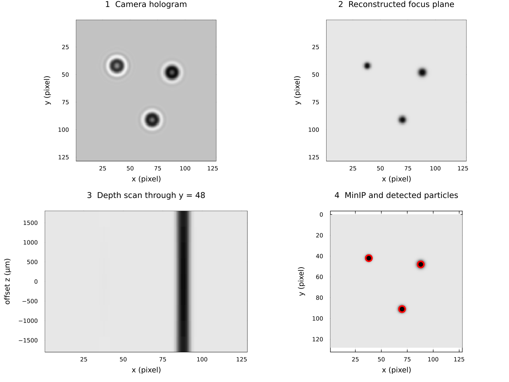

# From hologram to particles

## What a camera records

A coherent beam illuminates small objects. Light that passes directly through
the volume interferes with light diffracted by the objects, producing rings and
fringes on the camera. The camera records intensity, not optical phase. A
hologram therefore looks unlike an ordinary focused particle photograph.

The four panels follow one small numerical example from left to right and top
to bottom.
The camera plane contains diffraction rings rather than sharp particles.
Back-propagation makes the three absorbing particles sharp in their object
plane.
The depth scan shows how one particle changes along the optical axis.
The minimum-intensity projection collapses the depth stack to one image, and
the red circles show the final detections.

The example starts from a known complex synthetic object, propagates it to a
camera, and then reconstructs that known wavefront.
It illustrates the geometry and data products, not the accuracy of the Gabor
phase assumption or experimental phase retrieval.
The figure is regenerated by `docs/generate_assets.jl` with the public API, so
documentation drift is caught during the documentation build.

## What reconstruction computes

The angular-spectrum method Fourier-transforms a complex wavefront, multiplies
it by a distance-dependent transfer function, and inverse-transforms it. Doing
this at several distances produces a stack of virtual focal planes. A particle
becomes darkest and sharpest near its depth.

ParticleHolography has two wavefront entry points:

- `gabor_wavefront` uses the measured amplitude and assumes zero phase. It needs
  one image and is the simplest workflow, but contains the twin-image artifact.
- `phase_retrieval` alternates propagation between two measured hologram planes
  while restoring each measured amplitude. It needs a synchronized image pair,
  their separation, and camera alignment.

## Why plans exist

The optical geometry is constant across a time series. `PhaseRetrievalPlan` and
`ReconstructionPlan` store transfer arrays, FFT plans, and work buffers so the
frame loop does not rebuild them. A plan is tied to one backend, array shape,
and geometry; rebuild it when any of those change.

## From intensity to coordinates

The current detection method preserves the package's established processing:

1. classify dark voxels with a global threshold;
2. optionally dilate each XY slice;
3. run 8-connected components on each slice;
4. merge components whose inclusive XY boxes overlap through depth;
5. reject one-slice, tiny, or strongly elongated boxes;
6. select a focus slice and calculate an intensity-weighted XY centre;
7. optionally estimate equivalent diameter with Otsu binarisation.

This is not strict 3-D voxel connectivity. `particle_bounding_boxes` can merge
non-adjacent fragments at the same XY position to suppress holographic ghosts;
`particle_bounding_boxes_3d` only joins the immediately previous slice. Neither
can separate two physical particles that overlap in XY throughout depth.

## From coordinates to tracks

`labonte` applies the package's improved Labonté correspondence method to two
successive coordinate dictionaries and returns a directed graph. `enum_edge`
starts paths from the first graph, and `append_path!` extends and branches paths
with later graphs. UUIDs identify detections; they must be unique across frames.

For the propagation equations and phase-retrieval steps, continue to
[Inline holography theory](@ref introduction).
