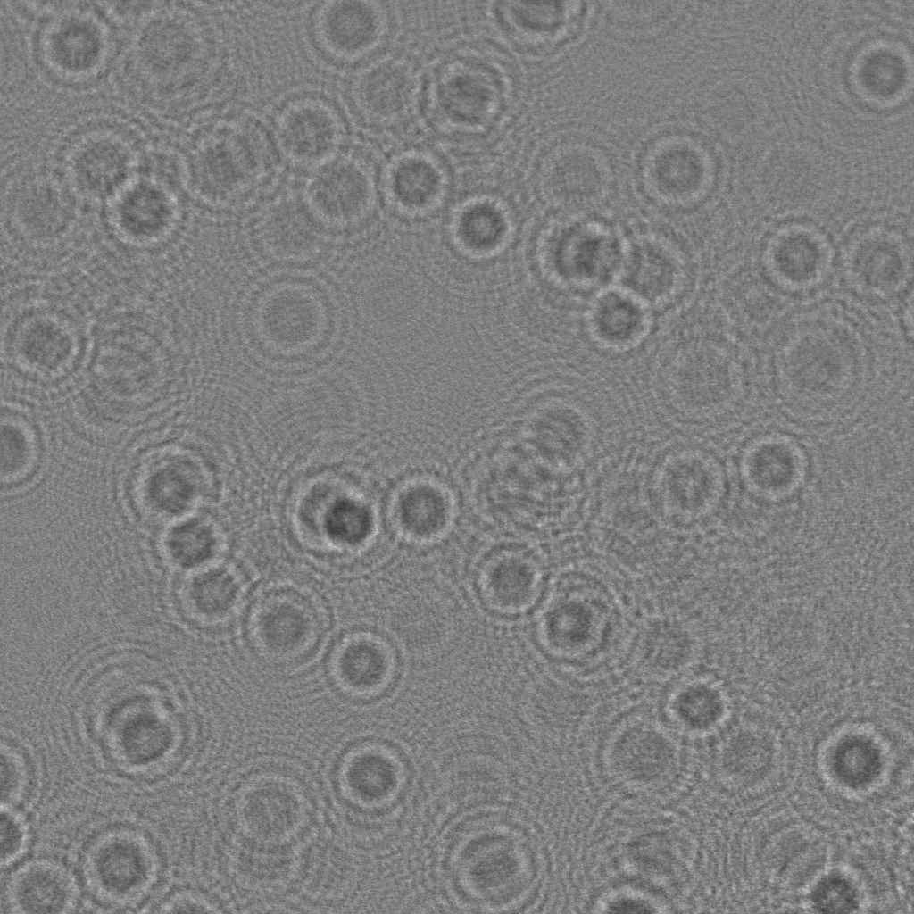
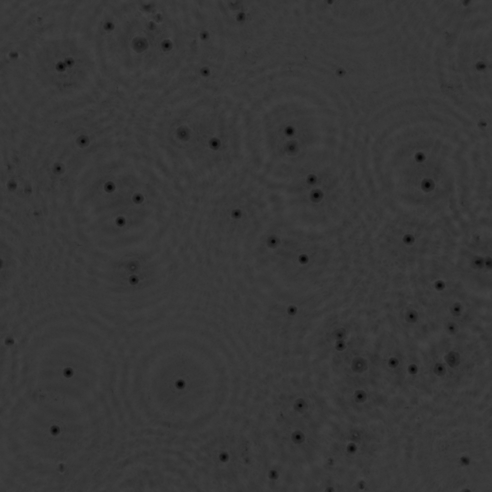

```@meta
CurrentModule = ParticleHolography
```

# ParticleHolography

Documentation for [ParticleHolography](https://github.com/dainakai/ParticleHolography.jl).

A package for particle measurement using inline holography.


!!! note "Note" 

    This package is under development, and none of the functions are guaranteed to work.


## What you can do with ParticleHolography.jl

- Perform inline holographic reconstruction using NVIDIA GPUs (CUDA.jl)
- Detect particles in reconstructed volumes
- Visualize the particle trajectories

```@raw html
<div style="display:flex; align-items:flex-start;">
   <div style="flex:1; margin-right:10px;">
       
       <p style="text-align:center;">Droplet holograms @4000 fps</p>
   </div>
   <div style="flex:1.23;">
       
       <p style="text-align:center;">Particle trajectories</p>
   </div>
</div>
```

## Installation

```julia
using Pkg
Pkg.add(url="https://github.com/dainakai/ParticleHolography.jl.git")
```

## Quick Start

### GPU-accelerated Gabor reconstruction

The code below is an example of performing inline holographic reconstruction using an NVIDIA GPU (CUDA.jl). Your computer needs to be ready to use NVIDIA GPUs with CUDA.jl. It reconstructs a volume of size `datlenΔx` x `datlenΔx` x `slicesΔz` when the camera plane is considered as the ``xy`` plane and the direction perpendicular to the camera plane, which is the optical axis, is the ``z`` axis. Furthermore, it creates an `xy` projection image of the reconstructed volume by taking the minimum value of the ``z`` axis profile at each pixel in the ``xy`` plane of the reconstructed volume. The operation of extracting the xy projection image from the volume can be expressed by the following equation:

```math
\mathrm{xyproj}(x, y) = \min_{z} \left\{ \mathrm{rcstvol}(x, y, z) \right\}
```

Specify the hologram you want to reconstruct and the parameters, and save the projection image as `xyprojection.png`. 

```julia
using ParticleHolography
using CUDA
using Images

# Load hologram
img = load_gray2float("holo.png")

# Parameters
λ = 0.6328 # Wavelength [μm] 
Δx = 10.0 # Pixel size [μm]
z0 = 220000.0 # Optical distance between the hologram and the front surface of the reconstruction volume [μm]
Δz = 100.0 # Optical distance between the reconstructed slices [μm]
datlen = 1024 # Data length
slices = 500 # Number of slices

# Prepare the transfer functions
d_sqr = cu_transfer_sqrt_arr(datlen, λ, Δx)
d_tf = cu_transfer(z0, datlen, λ, d_sqr)
d_slice = cu_transfer(Δz, datlen, λ, d_sqr)

# Reconstruction
d_xyproj = cu_get_reconst_xyprojection(cu(ComplexF32.(sqrt.(img))), d_tf, d_slice, slices)

# Save the result
save("xyprojection.png", Array(d_xyproj)) # Copy the d_xyproj to host memory with Array()
```

```@raw html
<div style="display:flex; align-items:flex-start;">
   <div style="flex:1; margin-right:10px;">
       
       <p style="text-align:center;">Input hologram image</p>
   </div>
   <div style="flex:1;">
       
       <p style="text-align:center;">Output xy projection image</p>
   </div>
</div>
```

```@index
Pages = ["index.md"]
Order = [:function]
```

```@docs
load_gray2float
cu_transfer_sqrt_arr
cu_transfer
cu_get_reconst_xyprojection
```

