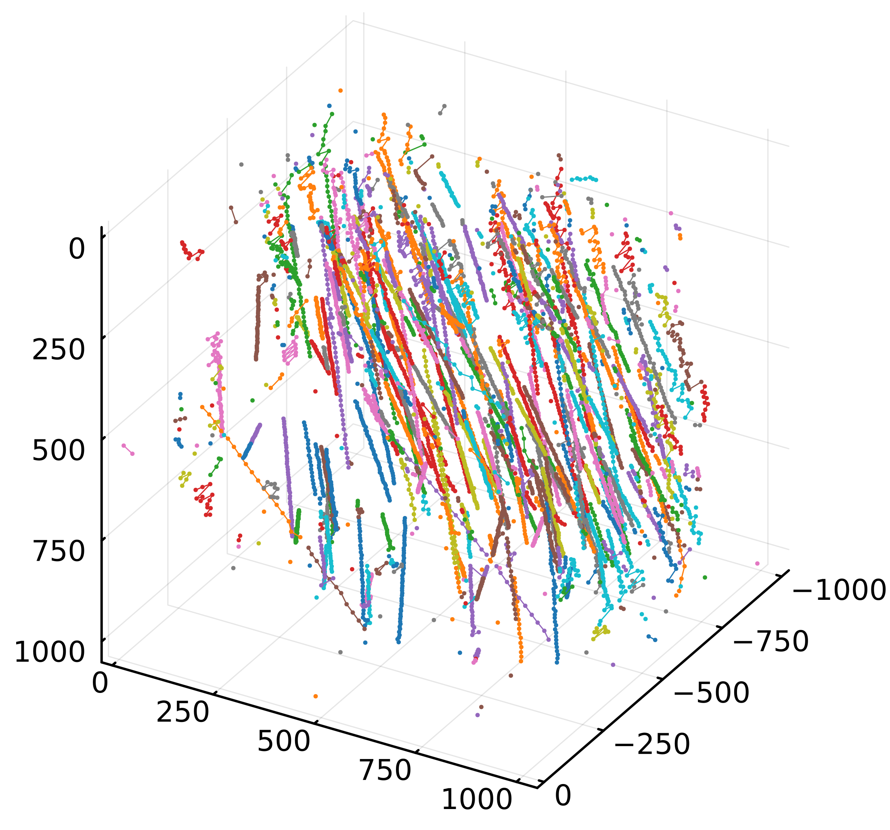

# Particle handling

This section explains the method of detecting particles from the hologram reconstruction volume, performing particle pairing on time-series data, and tracking particle trajectories.

## Particle detection

We start by detecting particles from the reconstructed image stack of the hologram. The process begins with binarizing the reconstruction stack using a global threshold and then performing connected component labeling to create bounding boxes for the particles. Various methods and values should be considered when determining the global threshold. It's advisable to use tools like ImageJ to adjust and decide on the threshold. The `cu_get_reconst_vol` function returns a reconstruction stack of type `N0f8` by default, which can be saved as an nrrd file using `NRRD.jl` and opened in Fiji as an 8-bit grayscale image stack (Tiff stack files are easier to open in ImageJ, but that process seems to be more complex). Among the binarization methods provided by these tools, the Minimum method often yields the best threshold. For time-series data, it's good to use a consistent threshold throughout the measurement series if lighting conditions remain unchanged.

Although not shown in the following example, when working with experimental data or reconstructed images where artifacts may occur and you want to set a strict threshold, it's beneficial to use the `cu_dilate` function to expand the binarized volume `d_bin_vol`. Ideally, the particle mask `d_bin_vol` should cover an area slightly larger than the true particle image. This is because depth position determination methods may examine the difference between the particle image and its surroundings or utilize the gradient intensity of the particle contour. This expansion process is a normal dilation operation and is executed on the GPU, similar to the reconstruction process.

The connected component labeling applied to the binarized volume is not a strict 3D labeling in the conventional sense. First, 2D connected component labeling [playne](@cite) ([GPU implementation](https://github.com/FolkeV/CUDA_CCL)) is performed on each slice, and then elements that overlap even partially in x-y coordinates across all slices are considered identical. In other words, this process does not distinguish between different particles that overlap in x-y coordinates. As long as particles do not overlap, this method provides rough Bounding Boxes for particles and suppresses ghost particles. After completing the labeling and Bounding Box creation for all slices, we exclude those that can be considered ghost particles or are too small to observe. For more details, refer to the [`finalize_particle_neighborhoods!`](@ref finalize_particle_neighborhoods!) function.

The particle Bounding Boxes are provided in dictionary format. The `key` is a UUID, and the `value` is in the format `[xmin, ymin, zmin, xmax, ymax, zmax]`. This is used to evaluate the coordinates and size of the particles. The UUID keys assigned during the creation of Bounding Boxes are carried over to create a new dictionary, which is then returned. If only coordinates are evaluated, the key is a 3-dimensional vector; if particle size is also evaluated, it's 4-dimensional. Evaluation functions can take depth position determination methods and particle size evaluation methods as arguments. For more details, refer to the respective functions: [`particle_coordinates`](@ref particle_coordinates), [`particle_coor_diams`](@ref particle_coor_diams)

```julia
using ParticleHolography
using CUDA

λ = 0.6328 # Wavelength [μm]
Δx = 10.0 # Pixel size [μm]
z0 = 80000.0 # Optical distance between the hologram and the front surface of the reconstruction volume [μm]
Δz = 100.0 # Optical distance between the reconstructed slices [μm]
datlen = 1024 # Data length
slices = 1000 # Number of slices
pr_dist = 80000.0 # Optical distance between the two holograms [μm]
pr_iter = 9
threshold = 30/255

img1 = load_gray2float("./holo1.png")
img2 = load_gray2float("./holo2.png")

d_sqr = cu_transfer_sqrt_arr(datlen, λ, Δx)
d_tf = cu_transfer(-z0, datlen, λ, d_sqr)
d_slice = cu_transfer(-Δz, datlen, λ, d_sqr)
d_pr = cu_transfer(pr_dist, datlen, λ, d_sqr)
d_pr_inv = cu_transfer(-pr_dist, datlen, λ, d_sqr)

# Phase retrieval using Gerchberg-Saxton algorithm
d_holo = cu_phase_retrieval_holo(cu(img1), cu(img2), d_pr, d_pr_inv, pr_iter, datlen)

# Reconstruction
d_vol = cu_get_reconst_vol(d_holo, d_tf, d_slice, slices)

# Binarization
d_bin_vol = d_vol .<= threshold

particle_bbs = particle_bounding_boxes(d_bin_vol)
particle_coords = particle_coordinates(particle_bbs, d_vol)

# Save the particle coordinates
dictsave("particles.json", particle_coords)
```

## Scatter plotting

Let's plot the detected particles at each time point as a scatter plot. Since the correspondence of particles between time-series frames is still unknown at this point, we'll plot the particles at each time point in different colors. The plot recipe [`particleplot`](@ref particleplot) provided by ParticleHolography.jl is a simple arrangement of `Plots.scatter()`, but please note that there are differences in how the coordinate axes are handled.

```julia
using ParticleHolography
using Plots
using Glob

files = glob("savejson_lpf4_priter6_th24/*.json")[1:50]

colors = cgrad(:viridis)[LinRange(0, 1, length(files))]
plot()
for (idx, file) in enumerate(files)
    data = dictload(file)
    particleplot!(data, legend = false, scaling=(10.0, 10.0, -100.0), shift=(0.0, 0.0, 1e5), color=colors[idx], xlabel="x [µm]", ylabel="z [µm]", zlabel="y [µm]", xlim=(0,10240), ylim=(0,1e5), zlim=(0,10240))
end

plot!()
```


## Particle pairing

While overlaying detected particles from each time series creates an impactful and attractive image, what's truly crucial for many is understanding the correspondence of particle positions between time series frames. In other words, which particle in one frame corresponds to which in the next? When particle density is relatively low, a nearest neighbor approach suffices. However, as density increases, more advanced techniques become necessary. That said, particle tracking velocimetry (PTV) methods for extremely high particle densities, such as those described by [schanz](@cite), are unnecessary in our context. This is because hologram reconstruction becomes challenging when particle image areas exceed 20% of the x-y projection of the reconstructed image (refer to [Gabor holography](@ref gabor_reconst)). ParticleHolography.jl employs an improved version of Labonté's algorithm [ohmi, labonte](@cite) for particle pairing.

Labonté's algorithm elucidates the correspondence between particles in two consecutive time frames. In ParticleHolography.jl, this relationship is represented as a directed graph through the [`Labonte`](@ref Labonte) implementation. To track particles across three or more consecutive frames and obtain all trajectories, we combine these directed graphs and enumerate all paths from each starting point to each endpoint. The functions [`enum_edge`](@ref enum_edge) and [`append_path!`](@ref append_path!) perform these operations.

```julia
using ParticleHolography
using Glob

# Load the particle coordinates
files = glob("savejson_lpf4_priter6_th24/*.json")[1:5]

# Convert to dictionary with UUID keys and Float64 values
dicts = ParticleHolography.dictload.(files)

graphs = [Labonte(dict1, dict2) for (dict1, dict2) in zip(dicts[1:end-1], dicts[2:end])]

paths = ParticleHolography.enum_edge(graphs[1])

for graph in graphs[2:end]
    append_path!(paths, graph)
end
```

```
julia> paths[1]
5-element Vector{Base.UUID}:
 UUID("02defbf6-401e-11ef-1a7e-43a2532b2fa8")
 UUID("078214ac-401e-11ef-1a7e-43a2532b2fa8")
 UUID("0c0dcbb2-401e-11ef-1a7e-43a2532b2fa8")
 UUID("109fd490-401e-11ef-1a7e-43a2532b2fa8")
 UUID("15196216-401e-11ef-1a7e-43a2532b2fa8")
```

## Trajectory plotting

Let's visualize the trajectories. We'll draw the trajectories using `paths` obtained in the previous section and `fulldict` obtained from the [`gen_fulldict`](@ref gen_fulldict) function. Particles considered identical are drawn in the same color, while different trajectories are drawn in different colors. As there are only as many colors as there are in the palette, colors will be reused if there are more trajectories than the number of colors in the palette.

```julia
files = glob("savejson_lpf4_priter6_th24/*.json")[1:50]
fulldict = gen_fulldict(files)

trajectoryplot(paths, fulldict)
```



## References

```@bibliography
Pages = ["particle.md"]
```