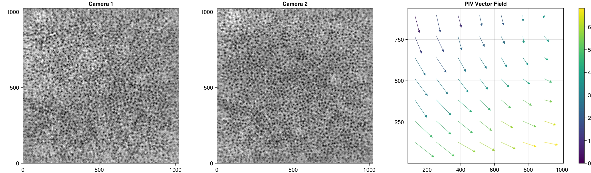
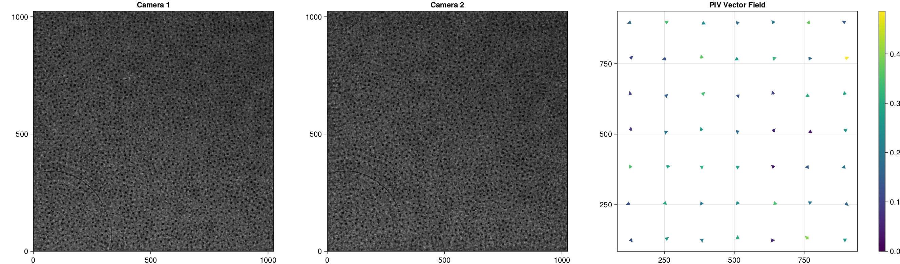

# Phase retrieval holography

Please refer to [Phase retrieval holography](@ref pr_explain) for the principles of this method. Below, we show the necessary procedures and an implementation example for reconstructing using this method.

## Bundle adjustment

We perform bundle adjustment [okatani](@cite) to correct for rotational and aberrational misalignments between the two camera views in the ``xy ``plane. First, for a pair of images with densely distributed features throughout the field of view, such as a glass plate with printed random dots, we create a vector map of displacement amounts (right figure below) by calculating the cross-correlation coefficients between neighboring batches between the two images, similar to Particle Image Velocimetry (PIV) [willert](@cite). This map represents the displacement of `img2` relative to the reference image `img1`. By determining the image transformation coefficients ``\bm{a}`` that make this map nearly zero throughout, alignment is achieved.

```math
\begin{aligned}
x' &= a_1 + a_2 x + a_3 y + a_4 x^2 + a_5 xy + a_6 y^2 \\
y' &= a_7 + a_8 x + a_9 y + a_{10} x^2 + a_{11} xy + a_{12} y^2
\end{aligned}
```

Prepare a set of benchmark images, such as a glass plate with printed random dots. The following are Gabor reconstruction images of random dot holograms.

```@raw html
<div style="display:flex; align-items:flex-start;">
   <div style="flex:1; margin-right:10px;">
       
       <p style="text-align:center;">Camera 1 image</p>
   </div>
   <div style="flex:1;">
       
       <p style="text-align:center;">Camera 2 image</p>
   </div>
</div>
```

We perform bundle adjustment on these images. If `verbose=true` is specified, the images before and after the bundle adjustment transformation and the displacement map are saved. If not specified (default is verbose=false), only the transformation coefficients are returned.

```julia
using ParticleHolography

# Load images
img1 = load_gray2float("./test/impcam1_enhanced.png")
img2 = load_gray2float("./test/impcam2_enhanced.png")

# Bundle adjustment
coeffs = get_distortion_coefficients(img1, img2, verbose=true)
```

```
12-element Vector{Float64}:
  1.2327552152117167
  1.0015525820910993
 -0.0037540380646719548
 -2.6720154054315695e-7
 -3.948548695992629e-7
  2.473601876134243e-7
 -2.168620598151057
  0.0038907742401993704
  1.0008643186894999
  8.964404907592924e-8
  7.124903769000833e-9
  1.3007094240084437e-7
```


*Before bundle adjustment*


*After bundle adjustment*

Using the coefficient array obtained in this way, we correct the distortion of the captured images.

```julia
img2_corrected = quadratic_distortion_correction(img2, coeffs)
```

## Reconstruction

```julia
using ParticleHolography
using CUDA
using Images

# Load hologram
img1 = load_gray2float("./test/holo1.png")
img2 = load_gray2float("./test/holo2.png")

# Parameters
λ = 0.6328 # Wavelength [μm] 
Δx = 10.0 # Pixel size [μm]
z0 = 80000.0 # Optical distance between the hologram and the front surface of the reconstruction volume [μm]
Δz = 100.0 # Optical distance between the reconstructed slices [μm]
datlen = 1024 # Data length
slices = 1000 # Number of slices

# Parameters for phase retrieval holography
prz = 80000.0 # Distance between the two holograms [μm]
priter = 20 # Number of iterations of the Gerchberg-Saxton algorithm

# Prepare the transfer functions
d_sqr = cu_transfer_sqrt_arr(datlen, λ, Δx)
d_tf = cu_transfer(-z0, datlen, λ, d_sqr)
d_slice = cu_transfer(-Δz, datlen, λ, d_sqr)
d_pr = cu_transfer(prz, datlen, λ, d_sqr)
d_pr_inv = cu_transfer(-prz, datlen, λ, d_sqr)

# Image correction
img2_corrected = quadratic_distortion_correction(img2, coeffs)

# Retrieve phase information
d_holo = cu_phase_retrieval_holo(cu(img1), cu(img2_corrected), d_pr, d_pr_inv, priter, datlen)

# Reconstruction
d_xyproj = cu_get_reconst_xyprojection(d_holo, d_tf, d_slice, slices)

# Save the result
save("xyprojection_pr.png", Array(d_xyproj)) # Copy the d_xyproj to host memory with Array()
```

```@raw html
<div style="display:flex; align-items:flex-start;">
   <div style="flex:1; margin-right:10px;">
       
       <p style="text-align:center;">Input hologram image</p>
   </div>
   <div style="flex:1;">
       
       <p style="text-align:center;">Output xy projection image</p>
   </div>
</div>
```

## Index

```@index
Pages = ["pr.md"]
Order = [:function]
```

## Functions

```@docs
get_distortion_coefficients
quadratic_distortion_correction
cu_phase_retrieval_holo
```

## References

```@bibliography
Pages = ["pr.md"]
```