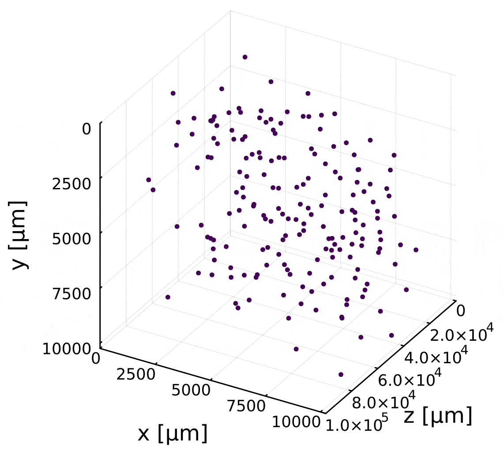
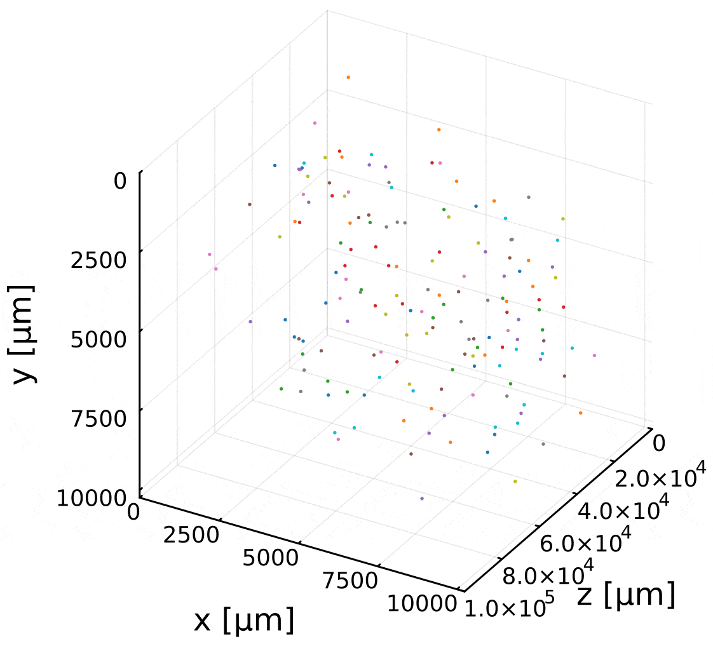

# Animated plots

In [Particle handling](@ref particle_handling), we explained how to plot particles and their trajectories. However, when dealing with time series data, it can be useful to save the temporal evolution as a GIF animation. Below, we provide several examples of how to do this.

## Animated ParticlePlot

```julia
using ParticleHolography
using Plots
using Glob

files = glob("savejson_lpf4_priter6_th24/*.json")[1:50]

colors = cgrad(:viridis)[LinRange(0, 1, length(files))]

plot()
anim = @animate for (idx, file) in enumerate(files)
    data = dictload(file)
    particleplot!(data, legend = false, scaling=(10.0, 10.0, -100.0), shift=(0.0, 0.0, 1e5), color=colors[idx], xlabel="x [µm]", ylabel="z [µm]", zlabel="y [µm]", xlim=(0,10240), ylim=(0,1e5), zlim=(0,10240), dpi=300)
end

gif(anim, "particles.gif", fps = 10)
```



## Animated TrajectoryPlot

!!! note "Note" 

    Creating animations using TrajectoryPlot may take a very long time. This issue will be addressed in future updates.

```julia
using ParticleHolography
using Plots
using Glob

files = glob("savejson_lpf4_priter6_th24/*.json")[1:50]

dicts = ParticleHolography.dictload.(files)

graphs = [Labonte(dict1, dict2) for (dict1, dict2) in zip(dicts[1:end-1], dicts[2:end])]

paths = ParticleHolography.enum_edge(graphs[1])

for graph in graphs[2:end]
    append_path!(paths, graph)
end

fulldict = gen_fulldict(files)

plot()
anim = @animate for idx in 1:50
    trajectoryplot!(paths, fulldict, framerange = (1, idx),legend = false, scaling=(10.0, 10.0, -100.0), shift=(0.0, 0.0, 1e5), xlabel="x [µm]", ylabel="z [µm]", zlabel="y [µm]", xlim=(0,10240), ylim=(0,1e5), zlim=(0,10240), dpi=300)
end

gif(anim, "trajectories.gif", fps = 10)
```


