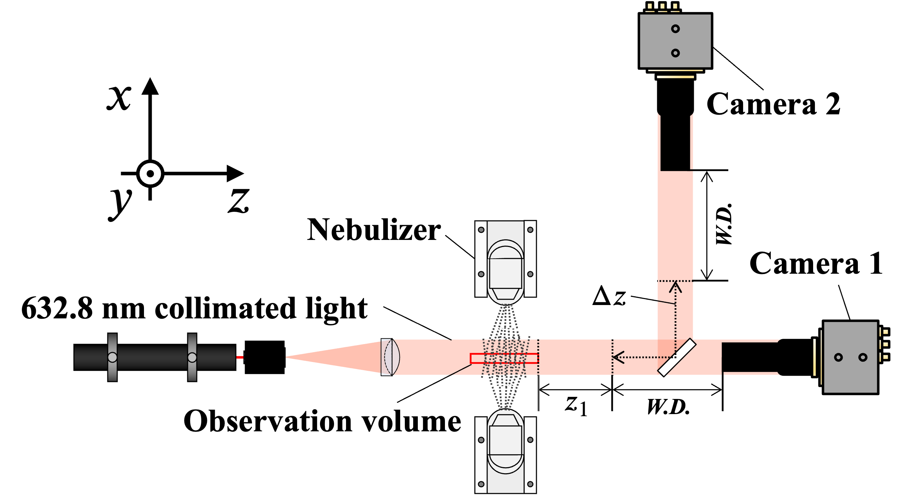
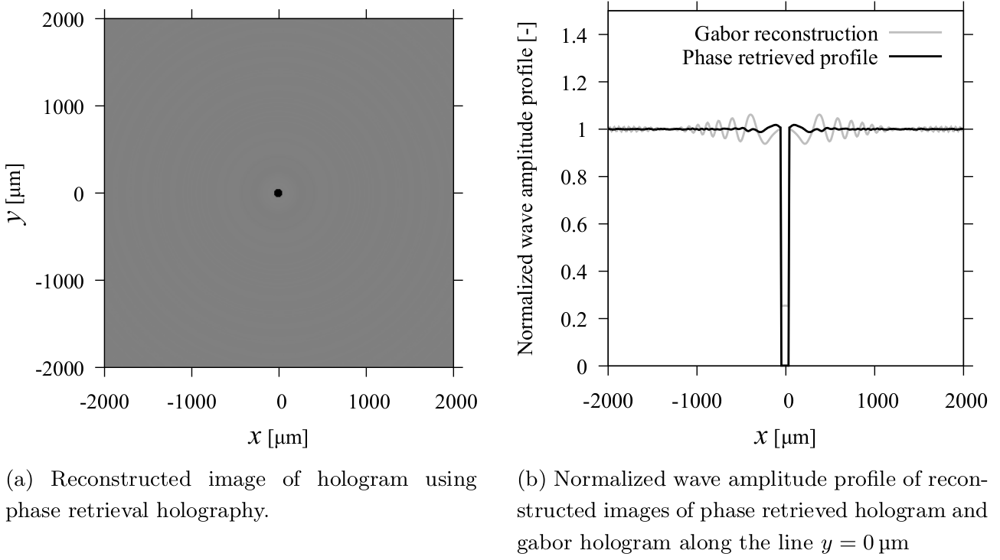

# Gabor's inline holography

## Introduction
Holography is an imaging and measurement technique first proposed by D. Gabor in 1948 [gabor](@cite). The interference pattern between the object light, which is diffracted by obstacles such as particles, and a reference light is recorded on a photosensitive material like a film, which is called a hologram. When the hologram is illuminated with a reconstruction light, the original light field is partially reproduced. In the case of small opaque objects like particles, the reconstructed light field is obstructed at the particle positions, appearing as dark images in the reconstruction. This allows the 3D position and shape of the objects to be observed. Currently, photosensitive materials have been replaced by digital cameras, and hologram reconstruction is commonly performed using digital image processing techniques such as numerical light propagation calculations. In an in-line holography setup, the coherent parallel light, the object observation volume, and the camera plane are all arranged along the same axis, eliminating the need to separate the object and reference light, and simplifying the reconstruction calculation. This article explains the light propagation calculation for parallel light, hologram recording and reconstruction, and the phase retrieval method, which is an advanced technique derived from Gabor holography.



## Collimated light propagation
The propagation of parallel light follows the Helmholtz equation and can be calculated quickly and accurately using the angular spectrum method [goodman](@cite) [kreis](@cite). Defining the optical axis of the parallel light as the ``z`` axis and the plane perpendicular to it as the ``xy`` plane, the wavefront of the parallel light at ``z=z_0`` is denoted as ``\psi(x, y; z_0)``. The light field propagated by ``\Delta z`` in the positive ``z`` direction is given by the following equation:

```math
\psi(x,y;z_0 + \Delta z) = \mathcal{F}^{-1}\left\{ \mathcal{F}\{\psi(x,y;z_0)\} \cdot \exp{\left( \frac{\mathrm{j}2\pi \Delta z}{\lambda} \sqrt{1-\left( \lambda \alpha \right)^2 - \left( \lambda \beta \right)^2} \right)} \right\}
```

Here, ``\mathcal{F}`` denotes the two-dimensional Fourier transform, ``\alpha, \beta`` are the Fourier domain variables corresponding to ``x,y``, and ``\lambda`` is the wavelength. This equation shows that by Fourier transforming the wavefront of the parallel light, multiplying it by the transfer function ``H_{\Delta z}=\exp{\left( \frac{\mathrm{j}2\pi \Delta z}{\lambda} \sqrt{1-\left( \lambda \alpha \right)^2 - \left( \lambda \beta \right)^2} \right)}``, and then performing an inverse Fourier transform, the light field propagated by ``\Delta z`` in the positive ``z`` direction can be obtained.

## Hologram recording (Computer generated holography)
Holography is a technique for reconstructing 3D images from obtained holograms, but it is also possible to numerically generate holograms by modeling the objects and their arrangements. Generally, an opaque particle with radius ``r_0`` located at ``(x_0,y_0,z_0)`` can be treated as a circular disk with zero thickness on the object plane ``x_0-y_0`` [vikram](@cite). The object plane ``A_0`` is represented as follows:

```math
A_0(x,y) = \begin{cases}
1 & \text{if} \quad (x-x_0)^2 + (y-y_0)^2 \leq r_0^2 \\
0 & \text{otherwise}
\end{cases}
```

The diffraction pattern of the particle appears on the hologram as the parallel light is blocked at the points where the object plane has a value of 1. The hologram can be calculated using the following equation:

```math
I(x,y; z_0+\Delta z) = \left| \mathcal{F}^{-1}\left\{ \mathcal{F}\{\psi(x,y;z_0)\cdot \left(1-A_0\right)\} \cdot H_{\Delta z} \right\} \right|^2
```

```\psi(x,y;z_0)``` is the wavefront of the parallel light just before passing through the object plane. If no objects exist before this point, the phase at each point can be set to 0, and we can assume ``\psi(x,y;z_0)=1``. Even if objects exist before this point, we can calculate the light field propagated from the position of the farthest particle by setting the phase there to 0 and using the same method as in the above equation. Since the hologram is the intensity distribution of the light field, it is represented by the square of the amplitude of the wavefront. The light field is a complex number, so this calculation involves taking the product with its complex conjugate.

## [Hologram reconstruction (Gabor holography)](@id gabor_explain)
It is possible to reconstruct a hologram by directly propagating the intensity distribution of the light field, which is the hologram, in the negative ``z`` direction [vikram](@cite). However, to maintain consistency with the phase retrieval method, which will be explained later, the reconstructed wavefront is taken as the square root of the hologram.

```math
\psi(x,y;z_0) = \mathcal{F}^{-1}\left\{ \mathcal{F}\{\sqrt{I(x,y;z_0+\Delta z)}\} \cdot \exp{\left( \frac{-\mathrm{j}2\pi \Delta z}{\lambda} \sqrt{1-\left( \lambda \alpha \right)^2 - \left( \lambda \beta \right)^2} \right)} \right\}
```

Generally, the particle positions are unknown during reconstruction. By varying the reconstruction distance ``-\Delta z`` throughout the observation volume, the particle positions within the volume can be determined. In practice, the wavefront is first propagated to the front surface of the observation volume closest to the camera using the transfer function for the distance to this surface. Then, transfer functions with finer reconstruction intervals are generated, and the wavefront is propagated at each interval to create ``z``-direction slices of the observation volume. This approach requires the generation of only two transfer functions.

## Twin image problem
In the hologram reconstruction equation above, the square root of the hologram is treated as the light field at that point, which naturally leads to the loss of phase information from the hologram. Consequently, the intensity of the reconstructed particle images does not match the values of the transmission function (defined as (1 - object plane)). For more details on these issues, refer to [kats](@cite) and [meng](@cite).


*Gabor reconstruction and its intensity profile*

If the phase information of the hologram could be restored to obtain an ideal reconstruction, as shown below, the threshold for particle detection could be lowered, resulting in improved particle detection performance. In the figure below, the restoration of phase information eliminates the conjugate image in the reconstruction, and the profile closely matches the correct transmission function plot.


*Phase retrieved reconstruction and its intensity profile*

The method that achieves this is phase retrieval holography [liu](@cite) using the Gerchberg-Saxton algorithm [gerchberg](@cite).

## [Phase retrieval holography](@id pr_explain)
Phase retrieval holography is a technique for reconstructing the optical wavefront, including phase information, from a pair of simultaneous holograms captured at two points separated by a propagation distance ``\Delta z_p`` from the object. Let's denote the hologram closer to the object plane as ``I_1`` and the other as ``I_2``. Using the same indexing, we define the optical wavefront ``\psi`` and its phase distribution ``\phi``. The following iterative operation (Gerchberg-Saxton algorithm) is repeated for the two holograms:

#### Initial condition
```math
\phi_1 = 0, \quad \psi_1 = \sqrt{I_1} \exp{\left( \mathrm{j}\phi_1 \right)}
```

#### STEP 1
```math
\psi_2 = \mathcal{F}^{-1}\left\{ \mathcal{F}\{\psi_1\} \cdot H_{\Delta z_p} \right\} \\
\phi_2 = \arg{\left\{ \mathcal{F}\{\psi_2\} \right\}}
```
The wavefront ``\psi_1`` is propagated by the hologram separation distance ``\Delta z_p`` to calculate the wavefront ``\psi_2``, and its argument is saved as the phase distribution ``\phi_2``.

#### STEP 2
```math
\psi_2 = \sqrt{I_2} \exp{\left( \mathrm{j}\phi_2 \right)}
```
The wavefront ``\psi_2`` is redefined by the square root of the hologram ``I_2`` and the phase distribution ``\phi_2``.

#### STEP 3
```math
\psi_1 = \mathcal{F}^{-1}\left\{ \mathcal{F}\{\psi_2\} \cdot H_{-\Delta z_p} \right\} \\
\phi_1 = \arg{\left\{ \mathcal{F}\{\psi_1\} \right\}}
```
The wavefront ``\psi_2 ``is back-propagated by the hologram separation distance ``\Delta z_p`` to calculate the wavefront ``\psi_1``, and its argument is saved as the phase distribution ``\phi_1``.

#### STEP 4
```math
\psi_1 = \sqrt{I_1} \exp{\left( \mathrm{j}\phi_1 \right)}
```
The wavefront ``\psi_1`` is redefined by the square root of the hologram ``I_1`` and the phase distribution ``\phi_1``.


For details such as the number of iterations of the above algorithm and camera arrangement, please refer to the literature such as [tanaka](@cite).

## References

```@bibliography
Pages = ["whats_inline_holography.md"]
```